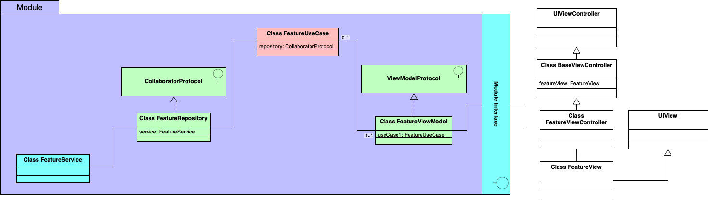

# modules-mvvm-c

Skeleton of MVVM-C architecture modularised

## Proposed Architecture

This project is a proposal on how to implement MVVM-C architecture using modules in an iOS project.

This approach was chosen as it gives the project a high level of:

- Scalability
- Testability
- Modularisation
- Reusability
- Readability

Uncle Bob guidelines on SOLID principles and clean architecture were applied. This [article](https://www.freecodecamp.org/news/a-quick-introduction-to-clean-architecture-990c014448d2/) was used as a base to implement this architecture.

### High level diagram

<!--  -->

#### Elements

- Service: It will be the external interface. It'll interact with the Collaborator in order to trigger some network requests, notifications, phone
devices (such as GPS, accelerometer, etc), etc.
- Collaborator: It shapes up the information coming from the service into entities so Use cases receive a clean object to work with. It's also
known as Interface adapters.
- Use case: It receives the necessary information from Collaborator and applies application business rules for the feature at hand.
- Entity: Encapsulate the information coming from outside the application into objects. It applies enterprise business rules. Also know as
Model.
- View model: Interface between the Use case and the Views. It receives the information coming from Use case and transform it to UI
elements. Also, receives UI interactions and forward this info to the Use case so Application business rules can be applied.
- View: UI elements such as labels, buttons, picker views, etc. It's what the user will perceive and what is going to receive touches and
gestures from him/her.

### Scenarios

The elements and interactions listed above will be encapsulated in Modules. This way, we will be able to reuse them.

#### Module with UI

In this scenario, the UI elements can be reused so we will include them inside the Module.

#### Module without UI
In this scenario, the UI elements will not be reused so we will not include them inside the Module.

